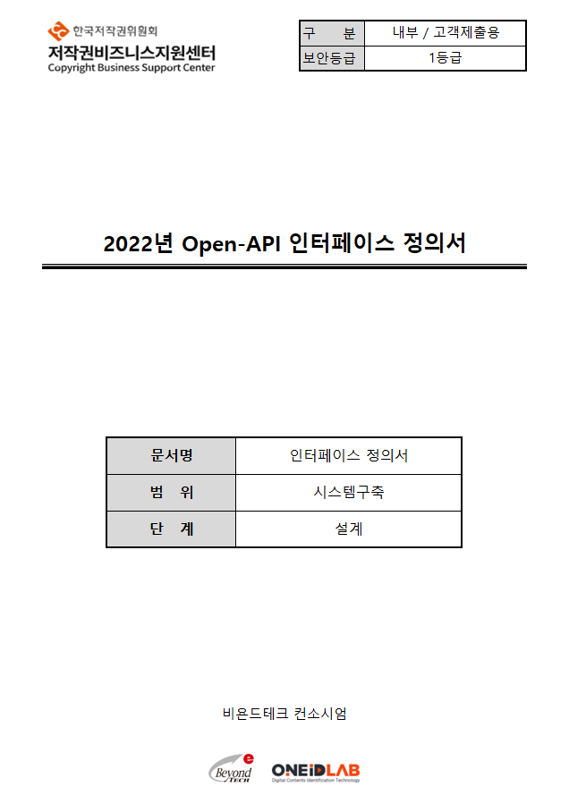
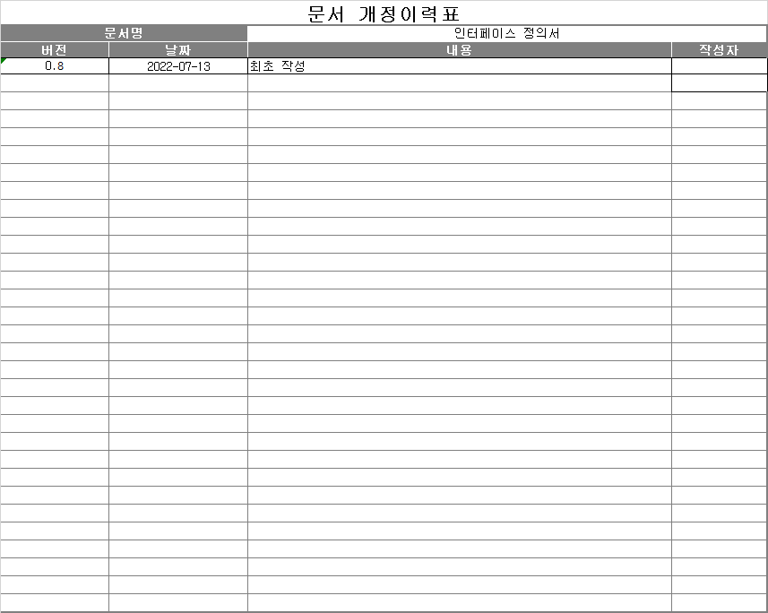
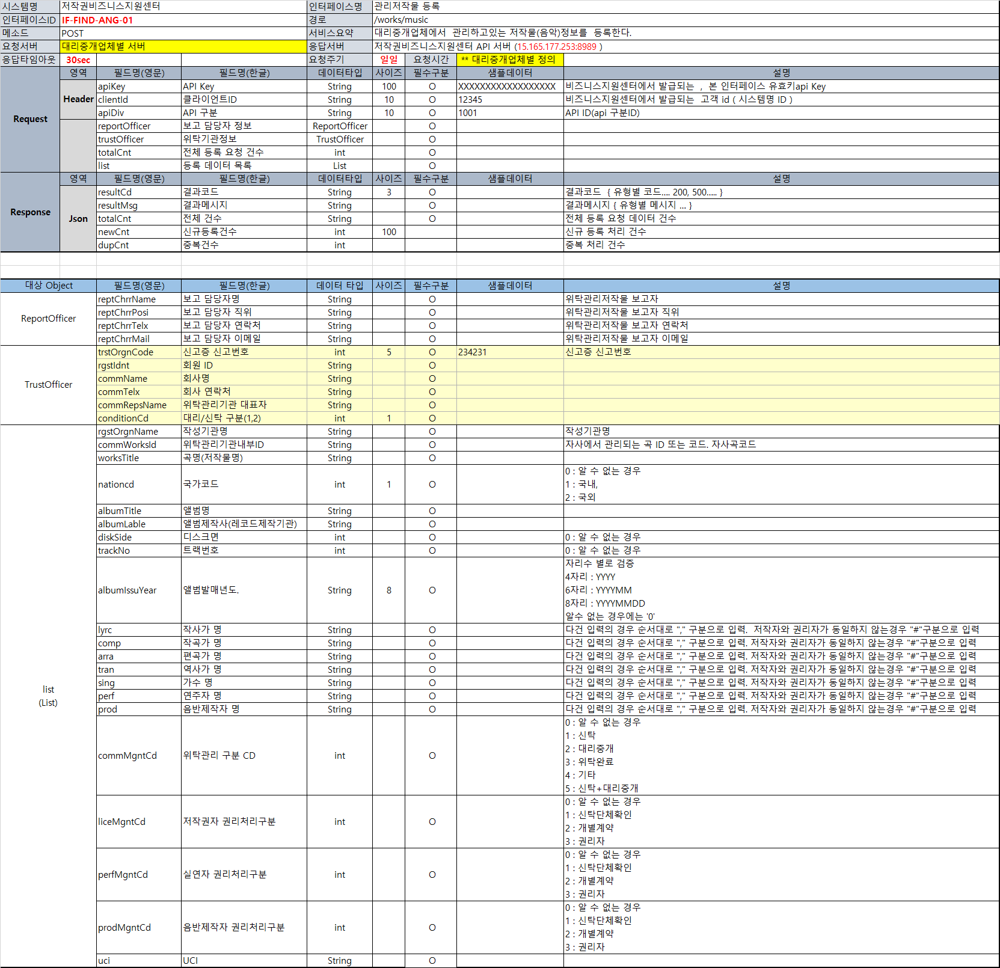
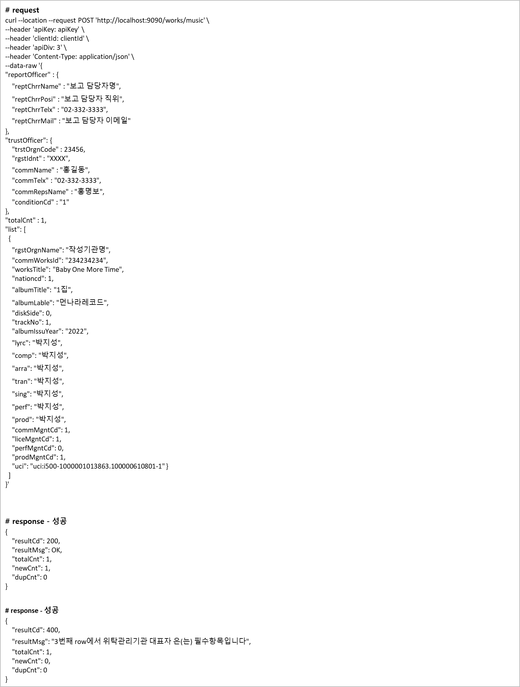
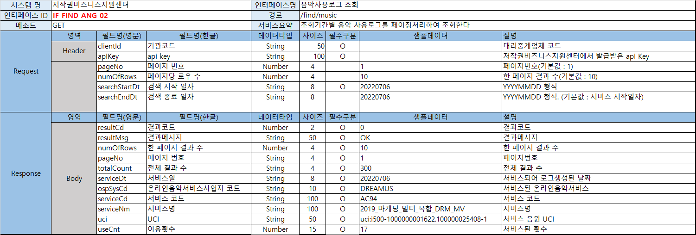

>
> 

<h1>저작물(음악)신고 API</h1>
<h3> 대리중개업체에서 관라하고 있는 저작물(음악) 정보를 등록한다.</h3>
<h4> 조건 </h4>

---
> request post <br>

> 응답 타임아웃: 30sec

>경로: /works/music

>요청주기: 일일

> 세부사항 : <br>
---
``` python
   request post 전송 예시
   import requests
   datas = {
   'key' : 'value1',
   'key2' : 'value2'
   }

   url = '사이트 주소'
   headers = {'Content-Type' : 'application/json; charset=utf-8}
   cookies = {'ck_test': 'cookies_test'}
   response = requests.plst(url, data=datas, headers = headers, cookies = cookies)
```
<h4>데이터 전송 포맷</h4>
>
---
<h4>구현 예시</h4>

---
   1. json으로 넘길 때:
       datas 부분을 json 형식으로 바꾸어 작성 후
``` python
       response = requests.plst(url, json=datas, headers = headers, cookies = cookies)
```
---
   2. ssl 인증 필요시:
``` python
       response = requests.plst(url, json=datas, headers = headers, cookies = cookies, verify = False)
       디폴트가 트루
``` 
---
   3. TimeOut 설정하기:
       특정 시간 동안 응답에 대한 결과가 없으면 exception을 발생.
``` python
       response = requests.post(url, data = datas, timeout=30)
```
    30초가 지나면 exception 발생
---
   4. 응답값 받아 처리하기
``` python
    response.request # 전송한 request 객체에 접근
    response.status_code # 응답 결과 코드
    response.raise_for_status() # 200 OK 코드가 아닌 경우 에러 발동
    response.json() #json response일 경우 딕셔너리 타입으로 바로 변환
``` 
---

<h1> 음악사용로그 조회API</h1>
---
> get 메소드 사용


<h4>공통 주의사항</h4>
1. 대리중계업체별로 api key 발급 및 관리 필요
2. 본규격에서 일부 항목 /수정/추가/삭제 될 수 있음.